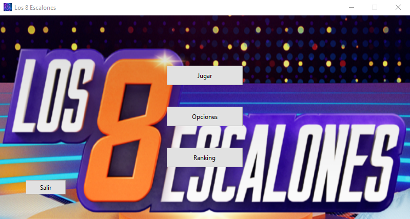
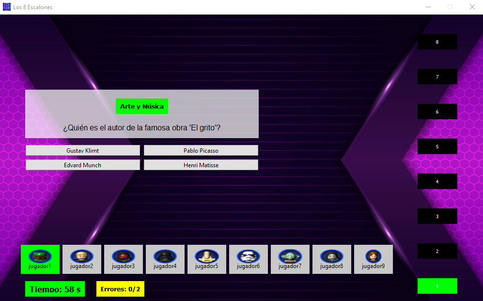
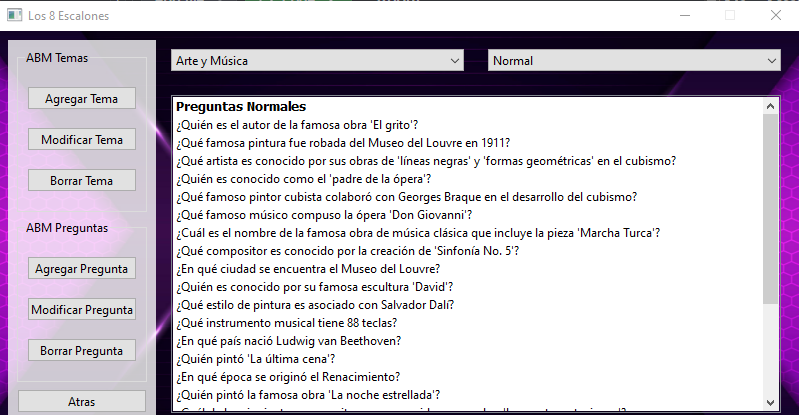

# 8escalones - Proyecto Final POO

Un juego interactivo desarrollado para el Trabajo Práctico Final de Programación Orientada a Objetos.

## Tecnologías utilizadas
- Python

## DESCARGAR
[https://github.com/chella16/8escalones/download/v1.0/8escalones.zip](https://github.com/chella16/8escalones/releases/download/APP/8escalones.rar)

## Capturas de pantalla
| Captura 1 | Captura 2 | Captura 3 |
|-----------|-----------|-----------|
|  |  |  |
| *Menú principal* | *Juego en acción* | *ABM preguntas* |

